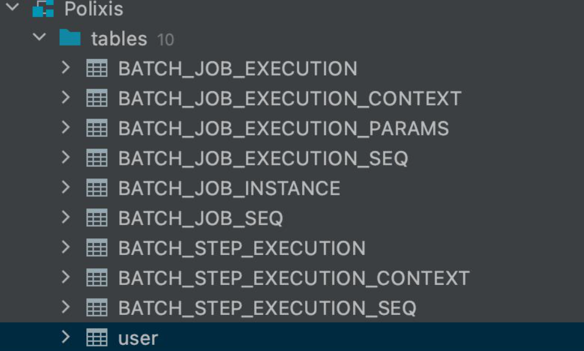
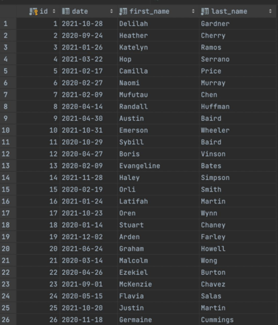
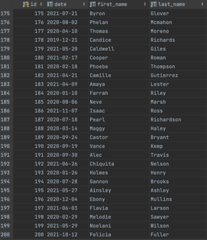

#What is Spring batch?
```
Spring Batch is part of Spring Framework.
```
```
Its a Java based framework for batch processing.
A lightweight, comprehensive batch framework.
POJO-based development approach, known from the Spring Framework.
Based on principles and advantages of Spring Framework.
 • It supports:
  – Concurrent batch processing.
  – Massively parallel batch processing. 
  – Manual or scheduled restart after failure. 
  – Commit batch periodically. – Other features.

What is Batch Processing?
 • The batch processing is used for batch applications to process high volume of data. 
 • Usually a batch application: 
 – Reads a high amount of data from several sources (DB, CSV/XML files,queues, web services, others). 
 – Process or transforms the data read following certain business rules. 
 – Writes the transformed data in one or more destinations. 
 • Usually batch applications are crucial for businesses because of: 
 – The amount of data they handle. 
 – The processing times of the data.
 • They follow the ETL principle in datawarehousing / datamining.
__
```

#Springbatch Concepts:
````
Job
 
• It is the most important concept in Spring Batch. 
• It needs a JobLauncher instance to be executed. 
• It can contain one or more steps, which can be executed in sequence or parallel.
````
````
Step

• It encapsulates an independent and sequential phase of a job. 
• It contains exactly a Reader, a Writer and optionally a Processor.
````
````
Reader
 
• It represents an abstraction which is responsible for recovering data from a source. 
• When it can not retrieve more data, it returns null.
````
````
Writer
 
• It represents the output for a step in chunk oriented processing. 
• There are various implementations out-of-the-box.
• It has not any knowledge about the reader implementation.
````
````
Processor 

• It is optional in the chunk oriented processing.
• It represents the business process for each item, and it can return a null, when that item doesn’t need to be written.
````
````
Listeners

Bring us the possibility to perform some actions during the execution of a Job and/or Step.

There are some types of listeners: 
• StepExecutionListener 
• ChunkListener 
• ItemReadListener 
• ItemProcessListener 
• ItemWriteListener 
• SkipListener
````
Spring Batch Framework offers ‘TaskletStep Oriented’ and ‘Chunk Oriented’ processing style.
````
TaskletStep

Tasklet is an interface, which will be called to perform a single task only, like clean or set up resources before or after any step execution.
````
````
Chunk Oriented

Chunk Oriented Processing Feature has come with Spring Batch v2.0. 
It refers to reading the data one at a time, and creating ‘chunks’ that will be written out, within a transaction boundary.
One item is read from an ItemReader, handed to an ItemProcessor, and written.
Once the number of items read equals the commit interval, the entire chunk is written out via the ItemWriter, and then the transaction is committed.
Basically, this feature should be used if at least one data item’ s reading and writing is required.
Otherwise, TaskletStep Oriented processing can be used if the data item’ s only reading or writing is required.
Chunk Oriented Processing model exposes three important interface as ItemReader, ItemProcessor and ItemWriter via org.springframework.batch.item package.
````
#Spring Batch with Spring Boot
This is Spring Boot Batch Processing CSV file information to MYSQL database.

#Implemented Spring Batch using Spring Boot

##Maven dependencies
````
<dependency>
   <groupId>org.springframework.boot</groupId>
   <artifactId>spring-boot-starter-batch</artifactId>
</dependency>
<dependency>
   <groupId>org.springframework.batch</groupId>
   <artifactId>spring-batch-test</artifactId>
<scope>test</scope>
</dependency>
````

##Application Properties

````
spring.datasource.url=jdbc:mysql://localhost/polixis
spring.datasource.username=root
spring.datasource.password=Password

spring.jpa.database-platform=org.hibernate.dialect.MySQL8Dialect

spring.jpa.hibernate.ddl-auto=create
spring.jpa.hibernate.naming.implicit-strategy=org.hibernate.boot.model.naming.ImplicitNamingStrategyJpaCompliantImpl
spring.jpa.properties.hibernate.format_sql=true

spring.batch.initialize-schema=always

zip-file-path=classpath:data/data.zip

#date patterns
dmy=dd/MM/yyyy
mdy=MMMM d, yyyy
````
**_Step 1_**

Extract data.zip file

**_Step 2_**

Reading multiple .csv files using MultiResourceItemReader Class

**_Step 3_**

Loading data from .csv files into MySQl DB using ItemWriter Interface


##ScreenShots


